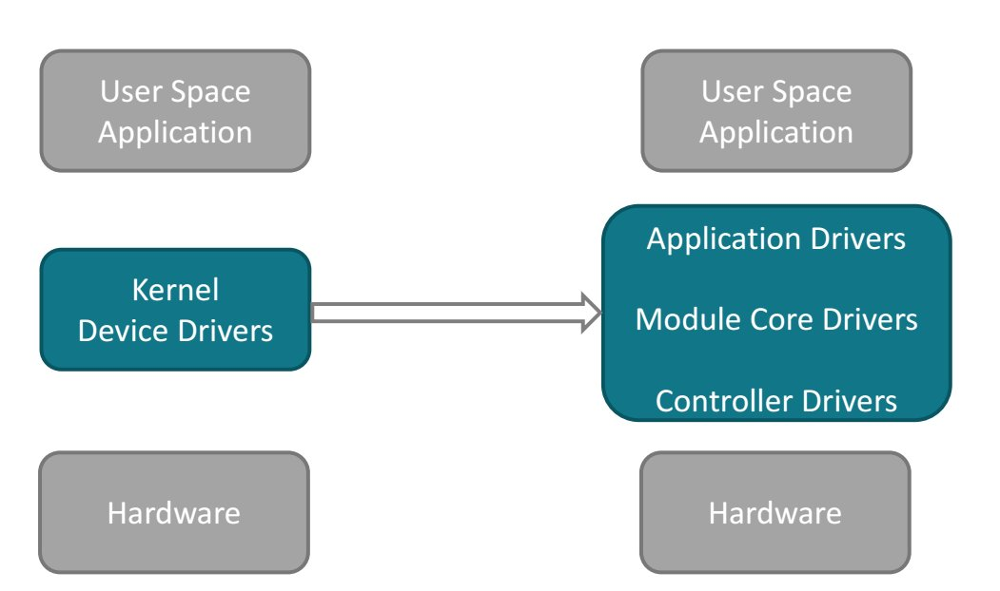
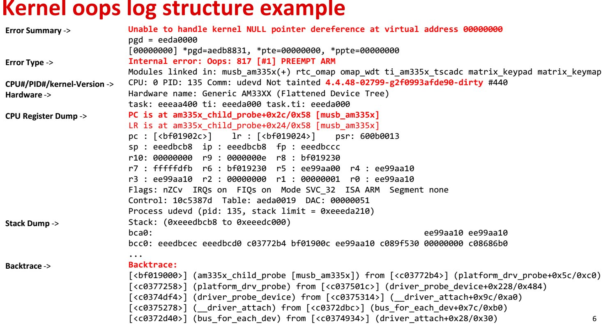

# ti source and video
https://training.ti.com/debugging-embedded-linux-systems-training-series?context=1128405


# dynamic debug
### What is dynamic debug?
Dynamically enable/disable kernel debug code at runtime to obtain kernel debug log:
- pr_debug()/dev_dbg()
- print_hex_dump_debug()/print_hex_dump_bytes()

### debugfs control interface
```
echo “<matches> <ops><flags>” > <debugfs>/dynamic_debug/control
```
- matches:
    - 'file' string
    - 'func' string
    - 'line' line-range
    - 'module' string (seen in lsmod) 
    - supports wildcard (* ?)
- ops:
    - '-' remove the given flags
    - '+' add the given flags
    - '=' set to the given flags 
- flags:
    - p print the log message
    - f include the function name
    - l include the line number
    - m include the module name
    - t include the thread ID
    - _ no flags are set 

### Enable debug messages during boot process
- uboot bootargs
    - dyndbg=“QUERY” < -- for kernel
    - module.dyndbg=“QUERY” < -- for module
- Example:
```
dyndbg="file ec.c +p"
```
# Device driver architecture overview 



# kernel oops
### Kernel oops log structure
- Error Summary
- Error Type
- CPU#/PID#/Kernel-Version
- Hardware
- CPU Register Dump
    - PC/LR
- Stack Dump
- Backtrace
  


### gdb
- gdb vmlinux
```
(gdb) list *(cppi41_dma_probe+0x2c4) 
```

### addr2line
```
 arm-linux-gnueabihf-addr2line -fe vmlinux c0328614
```
the result is:
```
cppi41_add_chans
drivers/dma/cppi41.c:679
```
